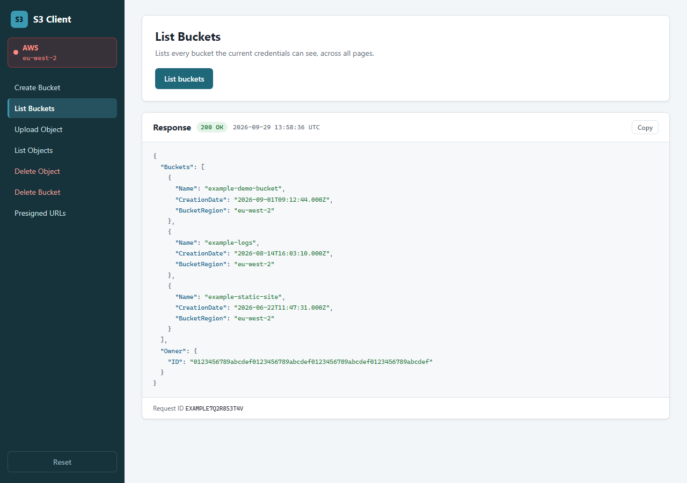
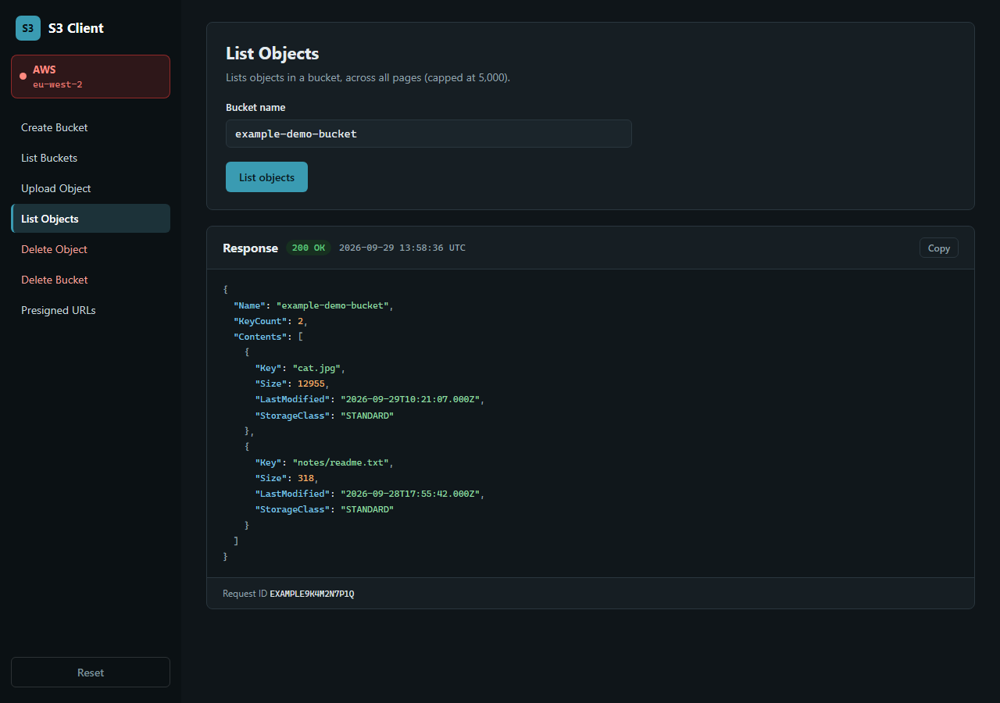
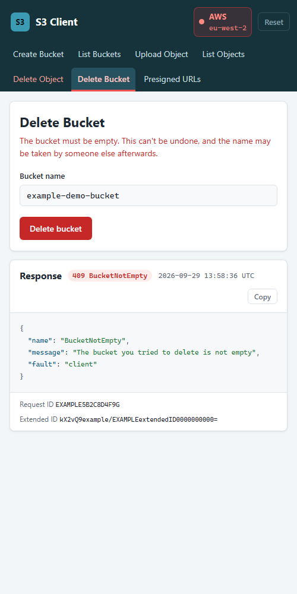
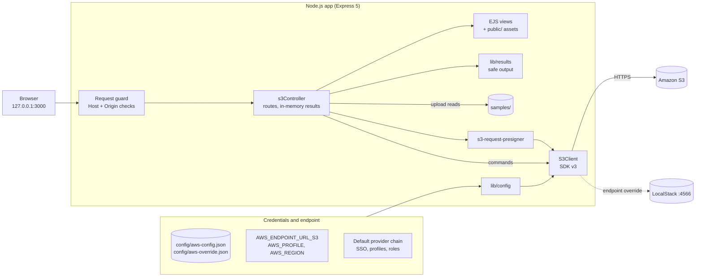
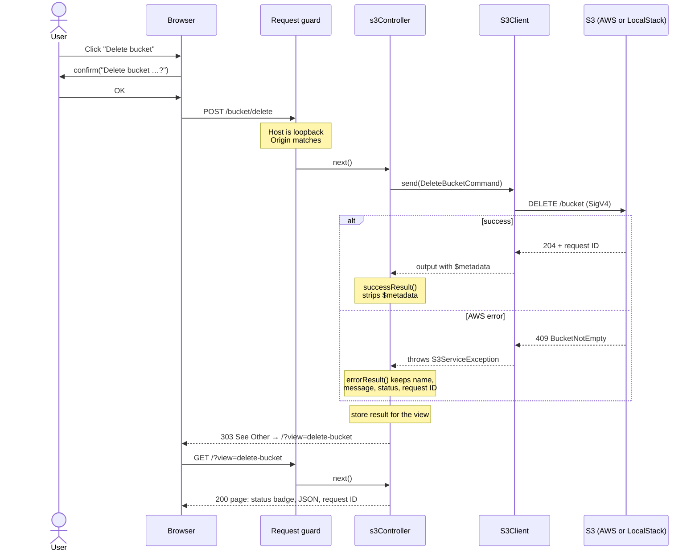

# AWS S3 Client

A small local web UI for exercising the Amazon S3 API: create, list and delete buckets, upload, list and delete objects, and generate presigned URLs. It runs against real AWS or a local S3 emulator such as LocalStack.

Built on Node.js 20+, Express 5, EJS and the modular AWS SDK for JavaScript v3.



| Dark theme | Narrow screen |
| --- | --- |
|  |  |

## Security notes

Read these before running it against a real AWS account.

- **No authentication.** Anyone who can reach the port can create and delete buckets and objects with your credentials. The server binds to `127.0.0.1` by default. Only set `HOST` to something else on a network you trust, and you'll get a warning on startup when you do.
- **CSRF and DNS rebinding.** POSTs whose `Origin` (or `Referer`) doesn't match the host are rejected, and when bound to loopback, so are requests whose `Host` header isn't `localhost`, `127.0.0.1` or `[::1]`. Requests with no `Origin` or `Referer` at all (curl, scripts) are allowed, because a browser always sends one on a cross-site POST. There are no CSRF tokens, so treat this as a local dev tool, not something to expose.
- **Prefer short-lived credentials.** Use the default AWS provider chain (`aws sso login`, a named profile, or a role) rather than static keys in a file. If you do use `config/aws-config.json`, it's git-ignored. Use a throwaway IAM user with a narrowly scoped policy, and delete the key when you're done.
- **Presigned URLs are bearer tokens.** Anyone with the URL can use it until it expires (default 1 hour, max 7 days). URLs signed with temporary credentials stop working when those credentials expire.
- **Errors are sanitised.** The response panel shows the error name, message, HTTP status and request IDs. Raw SDK error objects, which can include signing details such as `StringToSign`, are never rendered.
- **Uploads are restricted** to files inside the `samples/` folder, so the UI can't be used to upload arbitrary files from the server's disk.

## Features

- Permanent sidebar with every action, and red buttons plus a confirm dialog on destructive ones
- Environment badge: **red** for real AWS, **green** for a local endpoint (LocalStack), **amber** for any other custom endpoint, plus the region
- Response panel with the real AWS HTTP status, highlighted JSON, a copy button and the AWS request ID
- Post/redirect/get: actions redirect back to the page, so refreshing never repeats a create or delete
- Full pagination for List Buckets and List Objects (List Objects stops at 5,000 keys)
- Light and dark mode (follows your OS) and a narrow-screen layout

| Action | Route | SDK v3 command |
| --- | --- | --- |
| Create bucket | `POST /bucket` | `CreateBucketCommand` (adds `LocationConstraint` outside us-east-1) |
| List buckets | `GET /bucket` | `paginateListBuckets` |
| Upload object | `POST /bucket/file` | `PutObjectCommand` |
| List objects | `GET /bucket/objects?bucketname=` | `paginateListObjectsV2` |
| Delete object | `POST /bucket/file/delete` | `DeleteObjectCommand` |
| Delete bucket | `POST /bucket/delete` | `DeleteBucketCommand` |
| Presigned URLs | `POST /bucket/presign` | `getSignedUrl` for Get/Put/DeleteObject (local, no AWS call) |

## Install

```
git clone https://github.com/ajyounguk/aws-s3-client
cd aws-s3-client
npm install
```

## Credentials

The app picks credentials in this order:

1. **`config/aws-config.json`**, if it exists (static keys, not recommended):
   ```
   cp config/aws-config-sample.json config/aws-config.json
   ```
   It takes `accessKeyId`, `secretAccessKey`, optional `sessionToken`, and `region`. A file with only `region` sets the region and leaves credentials to the provider chain.
2. **Otherwise, the default AWS provider chain**: environment variables, SSO, shared config/credentials profiles, and container or instance roles. For example:
   ```
   aws sso login --profile my-profile
   AWS_PROFILE=my-profile AWS_REGION=eu-west-2 npm start
   ```

The config file is read once at startup, so restart the app after creating, changing or deleting it. The startup log shows which source is in use, for example `credentials: default provider chain`. It never prints the credentials themselves.

### IAM permissions

For a test user, scope the policy to a bucket-name prefix. List actions can't be resource-scoped, so they go on `*`. Replace the prefix and region:

```json
{
  "Version": "2012-10-17",
  "Statement": [
    { "Sid": "List", "Effect": "Allow", "Action": "s3:ListAllMyBuckets", "Resource": "*" },
    {
      "Sid": "Buckets", "Effect": "Allow",
      "Action": ["s3:CreateBucket", "s3:DeleteBucket", "s3:ListBucket"],
      "Resource": "arn:aws:s3:::my-prefix-*",
      "Condition": { "StringEquals": { "aws:RequestedRegion": "eu-west-2" } }
    },
    {
      "Sid": "Objects", "Effect": "Allow",
      "Action": ["s3:PutObject", "s3:GetObject", "s3:DeleteObject"],
      "Resource": "arn:aws:s3:::my-prefix-*/*",
      "Condition": { "StringEquals": { "aws:RequestedRegion": "eu-west-2" } }
    }
  ]
}
```

## Local S3 (LocalStack) and other endpoints

Point the app at another endpoint with, in order of precedence:

1. `AWS_ENDPOINT_URL_S3`
2. `AWS_ENDPOINT_URL`
3. `config/aws-override.json` (git-ignored):
   ```
   cp config/aws-override-sample.json config/aws-override.json
   ```
   ```json
   { "s3_endpoint": "http://localhost:4566" }
   ```

With an override, requests use path-style addressing (`http://localhost:4566/bucket`). For `localhost`, `127.0.0.1`, `localstack`, `host.docker.internal` and `*.localstack.cloud`, the badge turns green. If no credentials or profile are configured, the app uses LocalStack's dummy `test`/`test` keys, and the region defaults to `us-east-1`. Any other endpoint (MinIO, a proxy) shows an amber badge.

To start LocalStack, for example:

```
docker run --rm -p 127.0.0.1:4566:4566 localstack/localstack
```

## Run

```
npm start
```

Then open <http://127.0.0.1:3000>.

| Variable | Default | Purpose |
| --- | --- | --- |
| `PORT` | `3000` | Listen port |
| `HOST` | `127.0.0.1` | Bind address. Anything other than loopback exposes an unauthenticated UI |
| `AWS_PROFILE`, `AWS_REGION` | | Standard SDK settings |
| `AWS_ENDPOINT_URL_S3`, `AWS_ENDPOINT_URL` | | Endpoint override |

Results are held in memory for the life of the process. **Reset** clears them and the form pre-fills.

To upload your own files, put them in `samples/`. The object key is the file name. `cat.jpg` is included for your viewing pleasure.

## Tests

```
npm test
```

Uses `node:test`, `supertest` and `aws-sdk-client-mock`, so no AWS account or network is needed. The tests cover every route (success, AWS error and validation), pagination, config loading, the Origin and Host guard, error sanitising and page rendering, including XSS escaping.

## Project layout

```
app.js                  createApp() factory; listens only when run directly
lib/config.js           credentials and endpoint resolution
lib/results.js          safe success/error output for the response panel
controllers/            S3 routes
views/                  EJS page and partials (sidebar, forms, response)
public/                 stylesheet and client script (highlighting, copy, confirm)
samples/                files available to upload
config/                 sample config files (real ones are git-ignored)
test/                   node:test suites and fixtures
```

`createApp({ s3, environment, samplesDir })` accepts any `S3Client`, which is how the tests inject a mocked one.

## Architecture

### Components



### A destructive action (post/redirect/get)


